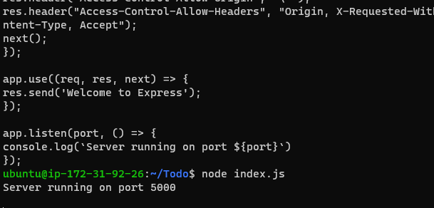

# Project 3

I started by setting up a new AWS ubuntu server with the existing security group and key and ensure connectivity from the terminal

update ubuntu with `sudo apt update` command

and did upgrade using `sudo apt upgrade`

installed node.js on the server and confirmed the version

`sudo apt-get install -y nodejs`

`node -v`

verify the node installation with the command below

`npm -v`

Created _*Todo*_ directory

went ahead to install ExpressJs
`npm install express` 

added file _*index.js*_ and did _*cat index.js*_ to see the script showing the inbound port after updating the script as in the documentation

 

 before confirming server is running on port 5000

with port 5000 running, I added inbound rule for our virtual machine security group

The success was then confirmed from the browser page using the URL format http://<PublicIP-or-PublicDNS>:5000

I moved on to create the routes directory and api.js file in the Todo directory

Next, I created models directory and todo.js file in the Todo directory after installing the Mongoose in the same Todo folder with `npm install mongoose`

Updated the api.js file as in the documentation

## MongoDB database
I created a shared cluster free account with mLab, selected AWS as the cloud provider and choosed the same (Virginia) region as my Ubuntu AWS server.

I followed the documentation through and succesfully created a MongoDB database and collection inside mLab

Created the _*.env*_ file in the Todo directory so that I can create the connection string to access the database in it

`touch .env`
`vi .env`

and added the string
DB = 'mongodb+srv://<username>:<password>@<network-address>/<dbname>?retryWrites=true&w=majority'

replacing the username, password, network address and DB with the one copied from the MongoDB cluster

With the need to update the index.js file, did `vi index.js` command, deleted the previous content and updated to reflect the use of *_.env_* so that Node.js can connect to the created database seamlessly

After the update of index.js with the required script as in the documentation, I started the server using `node index.js` command

I experienced a few errors when I did node index.js

but got it fixed by changing my MongoDB database server password which I have created using special character and I inserted the contents of _*index.js*_ using `vi index.js` command

I then moved on to installing POSTMAN, created a POST request to the API 

Edited the header to Content-type ensuring the value is _*application/json*_ and body as required to reflect what will be posted to the application frontend

And I set up the GET request request reflecting same

### Frontend creation
Installed the client for the frontend of the To-do app using the command below:

`npx create-react-app client`

I then installed all the required dependencies:
`npm install concurrently --save-dev`
`npm install nodemon --save-dev`

Then, I updated the _*package.json*_ file inside the Todo folder as indicated in the documentation

Added the key value pair in the package.json file "proxy": "http://localhost:5000"

Then, inside Todo directory, I did

`npm run dev`

The app should now open and start running on localhost:3000 as below after adding the port:3000 rule in the EC2 instance AWS server

I followed all the required steps in the Todo directory to make the Components directory inside the src directory in the client file

I created three directories simultaneously with the command belos:

`touch Input.js ListTodo.js Todo.js`

And edited the Input.js file with the script in the documentation, then saved. Before installing _*Axios*_ in the client folder

`npm install axios`

To get the frontend completely set up
I opened the _*ListTodo.js*_ file in the components directory and edited the contents with the required script, then saved

Then, edited the Todo.js file too as required

Updated App.js file, App.css and index.css

Then ran `npm run dev` in the Todo directory all with no errors...

At the end I got the required result in the Apps frontend!!!

Reflecting the _*POST and GET requests*_

******:
Honestly, it was a bit frustrating to start this report all over after loosing the initial one but I hope I did a good enough job as the project itself was so seamless for me...

